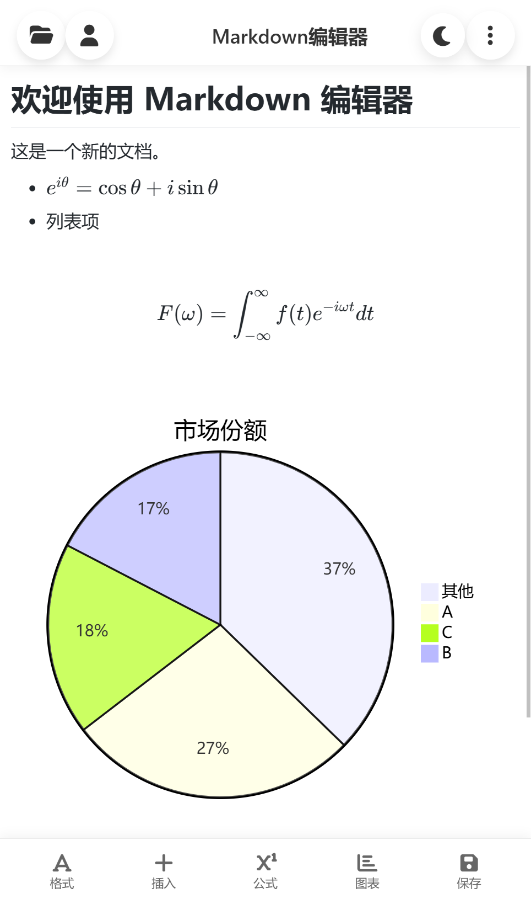
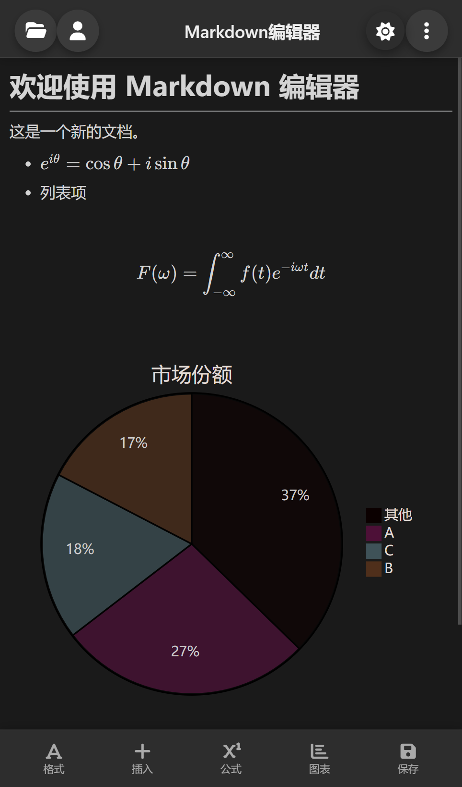
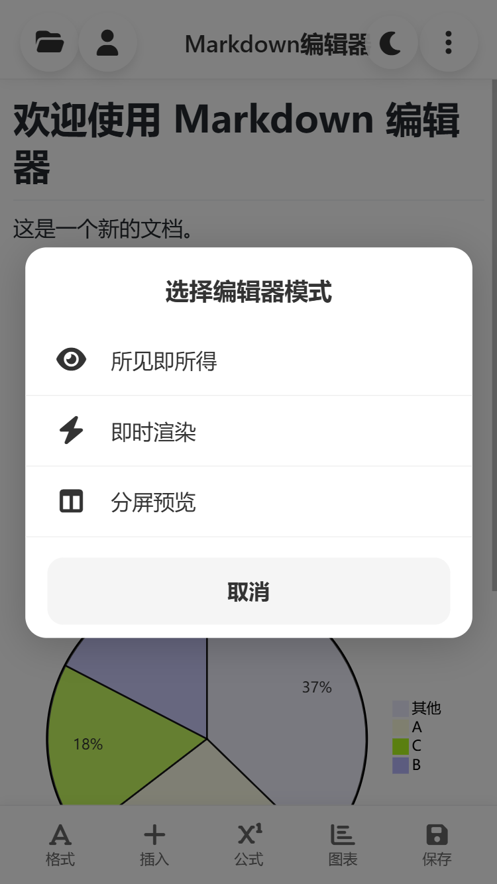
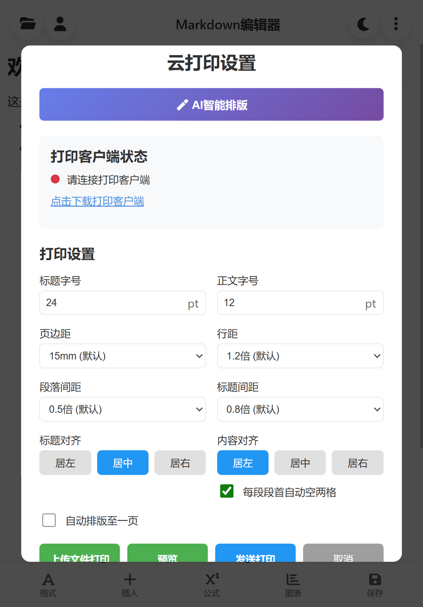
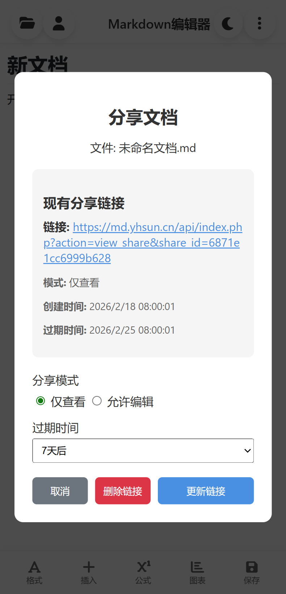
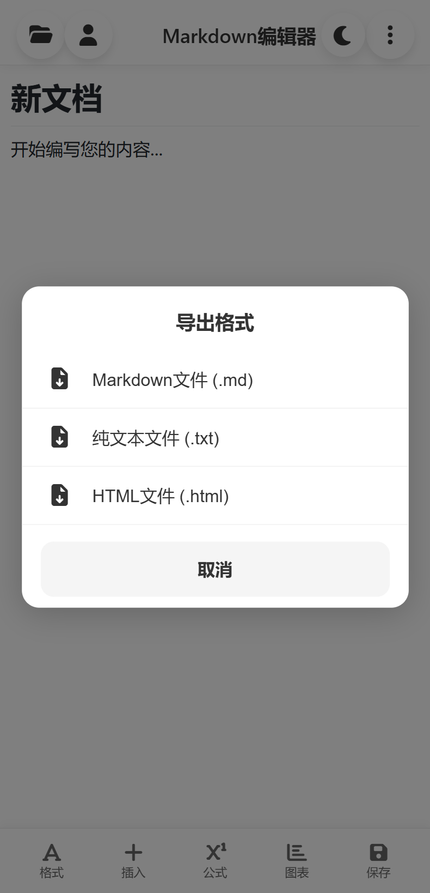
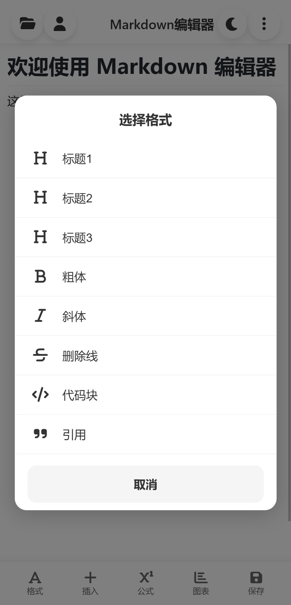
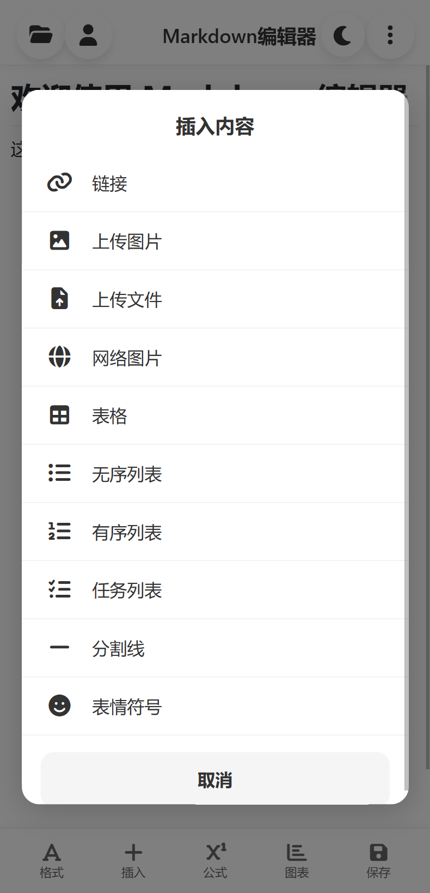
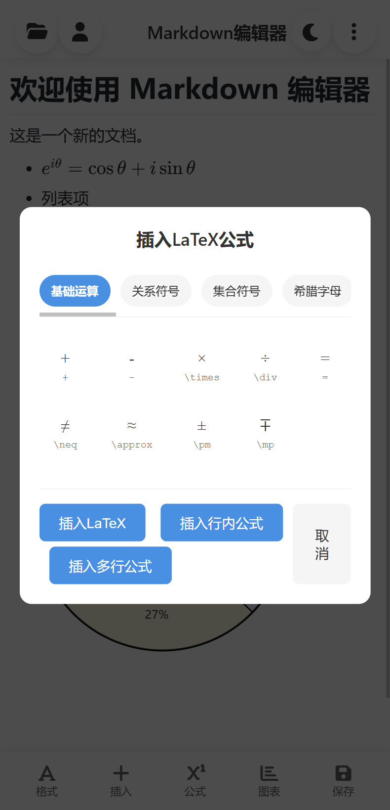
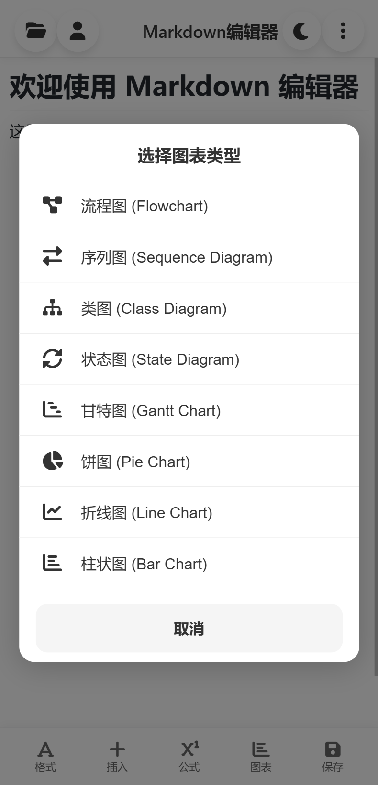

# markdown

基于Vditor的移动端轻量化在线markdown编辑器，可进行多文件管理。支持可视化插入格式、公式、图表，上传文件和图片，降低学习和操作门槛；支持多端文件同步，历史版本，文件分享，日间、夜间模式切换，导入本地文件，导出文档，云打印功能

项目采用JavaScript+Python架构，登录注册、文件上传、分享、历史版本等后端使用node实现，云打印服务端和客户端使用Python实现。
### 使用
网页提供日间模式和夜间模式两种配色

  
  

  
  
  
  

  
  
  
  

### 部署
- print文件夹下放置Python后端和打印客户端脚本。print_server.py需要部署在服务器上。通过`python3 start_print_service.py`命令启动服务器脚本。请自行部署ssl证书，并通过反向代理映射到8770端口。
- 运行打印客户端前需要安装`wkhtmltox`用于html转换为pdf，否则云打印客户端可能无法正确运行。

### Demo
https://md.yhsun.cn/
`测试账号test，测试密码123456`

### 联系
`18763177732@139.com`